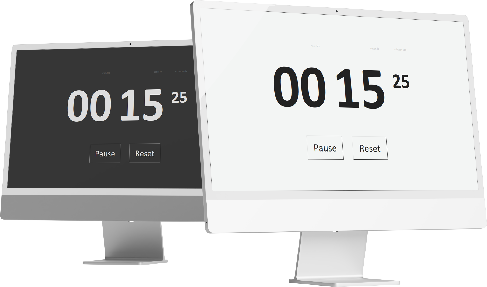

# Stopwatch

Stopwatch is a free easy and simple app for desktop (Windows, macOS, Linux) that will help you to measure time. It has three functions as shown below:
**Start**: To start the stopwatch time from the beginning or from the pause state.
**Pause**: To pause the stopwatch time.
**Reset**: To stop the stopwatch time and reset the time to zero.
Also the app supports **Light** and **Dark** interface styles. App appearance depends by your system.

## Demo

## Other

Stopwatch is created using the Python (v3.9.1) programming language and the following libraries: tkinter, time, darkdetect.

## Requirements

- Windows 10 1607+/macOS 10.14+/Linux with a dark GTK theme
- Python 3.9.1
- darkdetect 0.6.0

## Attributions

All covers has been designed using images from [Freepik.com](https://www.freepik.com/)
[darkdetect](https://github.com/albertosottile/darkdetect) by [albertosottile](https://github.com/albertosottile)  
[Mac screen psd](https://www.freepik.com/free-psd/minimalist-dual-pc-desktop-screen-mockup_17675010.htm#query=mac%20screen&position=0&from_view=keyword) created by [user16289356](https://www.freepik.com/author/user16289356)

---
[Behance project page](https://www.behance.net/gallery/144841233/Stopwatch-Application)

## License

GPL-3.0 license
